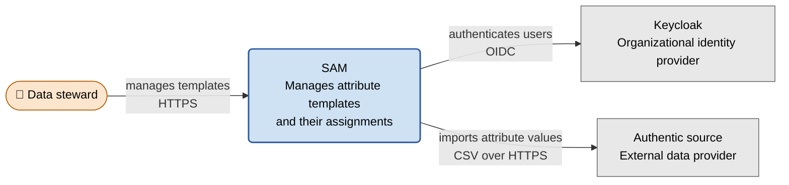
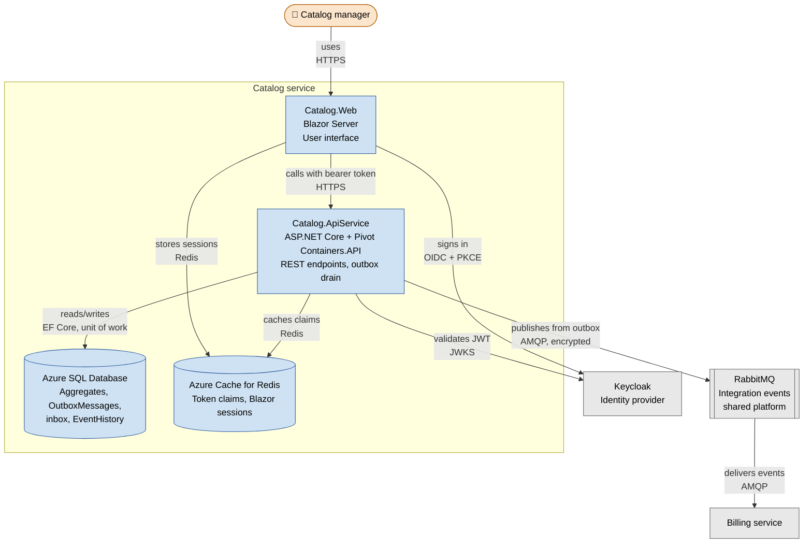
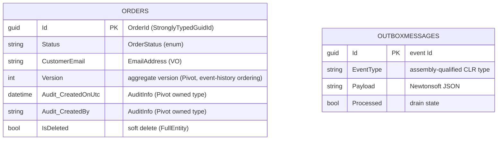
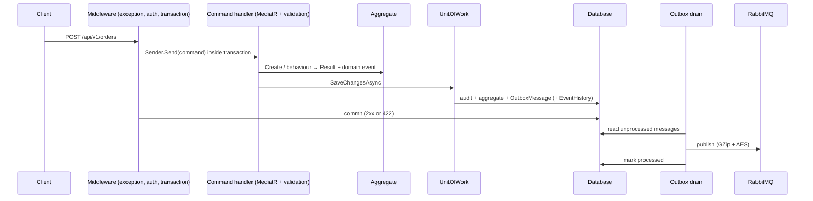

# Diagrams as Code

Source: Development Standards Wiki → *Diagrams as Code*. Cite rules as `Diagrams as Code / R<n>`. Severity handling follows `docs-standards-governance`.

## 1. Tools

- 🔴 **R1.** Diagrams are authored as code with **Mermaid**, **PlantUML**, **D2** or **Structurizr DSL**.
- 🔴 **R2.** Committing only an exported PNG/JPG/SVG of a GUI diagram is FORBIDDEN.
- 🟡 **R3.** Use **Mermaid** unless one of the next rules applies.
- 🟡 **R4.** Use **PlantUML** only when Mermaid lacks the UML diagram type (deployment, detailed component notation). PlantUML does not render in Azure DevOps Wiki: commit the rendered `.svg` next to the `.puml` source.
- 🟢 **R5.** D2 only for polished layouts on landing pages, and only when asked. It does not render in Azure DevOps Wiki.
- 🟢 **R6.** Structurizr DSL only when a C4 model needs several rendered views, and only when asked.

## 2. Mermaid subset for Azure DevOps Wiki

Azure DevOps Wiki bundles an old Mermaid version. Treat every Mermaid diagram as if it will be shown there.

- 🔴 **R7.** Allowed diagram types: `flowchart` / `graph`, `sequenceDiagram`, `classDiagram`, `stateDiagram` / `stateDiagram-v2`, `erDiagram`, `gantt`, `journey`, `pie`.
- 🔴 **R8.** FORBIDDEN diagram types: `C4Context`, `C4Container`, `C4Component`, `C4Dynamic`, `mindmap`, `timeline`, `quadrantChart`, `sankey`, `block-beta`. They render on GitHub but fail on the wiki, so "it works on GitHub" is not evidence.
- 🟡 **R9.** Draw C4 diagrams as `flowchart` with the conventions in section 4.
- 🟢 **R10.** Migration to native C4 syntax becomes possible only when Azure DevOps upgrades Mermaid; do not do it before the standard is amended.
- Use only syntax shown in this skill: node shapes from the table in section 4, `subgraph ... end`, labeled edges `-->|label|`, `classDef`, `class`, `<br/>` in labels, and the standard `sequenceDiagram` keywords (`participant`, `autonumber`, `alt`/`else`/`end`, `->>`, `-->>`). Do not use newer syntax such as `A@{ shape: ... }` node metadata or YAML front matter config blocks.

### Fence syntax

| Where the Markdown is rendered | Fence |
| --- | --- |
| Azure DevOps Wiki (the folder contains `.order` files, or it is a published code wiki) | `::: mermaid` … `:::` |
| Repository docs rendered by GitHub, MkDocs or Docusaurus | ` ```mermaid ` … ` ``` ` |
| Standalone `.mmd` file | No fence; the file contains only Mermaid source |

## 3. Location and naming

- 🔴 **R11.** Standalone architecture diagrams live in `/docs/diagrams/`.
- 🔴 **R12.** A diagram that illustrates one page is embedded inline in that page, not stored as a separate file.
- 🟡 **R13.** Standalone files use kebab-case names describing the subject: `context.mmd`, `container.mmd`, `container-auth.mmd`, `sequence-login.mmd`.
- 🟡 **R14.** Extensions: `.mmd` Mermaid, `.puml` PlantUML, `.d2` D2, `.dsl` Structurizr.

## 4. C4 model as flowcharts

- 🟡 **R15.** One diagram per C4 level: **Context** (system, users, external systems), **Container** (deployable units: apps, databases, queues), **Component** (inside one container), **Code** (only when it adds value).
- 🟡 **R16.** Every service repository has at least `docs/diagrams/context.mmd` and `docs/diagrams/container.mmd`.
- 🟡 **R17.** Use these shapes, always:

| C4 element | Mermaid shape | Syntax |
| --- | --- | --- |
| Person / actor | Stadium | `id([👤 Label])` |
| Software system (the one described) | Rounded rectangle | `id(Label)` |
| Container (app, API, worker) | Rectangle | `id[Label]` |
| Database | Cylinder | `id[(Label)]` |
| Queue / message bus | Subroutine | `id[[Label]]` |
| External system | Rectangle + `external` class | `id[Label]` then `class id external` |
| System boundary | Subgraph | `subgraph id[Label] ... end` |

- 🟡 **R18.** Apply exactly this palette with `classDef`, and assign every node a class:

```text
classDef person   fill:#fce5cd,stroke:#b45f06,stroke-width:1px,color:#000
classDef system   fill:#cfe2f3,stroke:#2c5aa0,stroke-width:2px,color:#000
classDef internal fill:#cfe2f3,stroke:#2c5aa0,stroke-width:1px,color:#000
classDef external fill:#e8e8e8,stroke:#666,stroke-width:1px,color:#000
```

Label conventions: first line is the name; following lines (`<br/>`) give the technology and responsibility. Edge labels state the interaction, then the protocol: `-->|reads/writes<br/>EF Core| db`.

### Context template



### Container template

A service built on Pivot.Framework, as deployed (no AppHost, no dev containers — see section 10):


Replace every node with the real system. Never keep an element you have not verified in the code or configuration.

## 5. Generated diagrams

- 🟡 **R19.** Generate ER diagrams from the database schema (tbls, schemaspy, dbml) in the pipeline rather than drawing them. tbls output uses `erDiagram`, which is allowed.
- 🟢 **R20.** Dependency graphs may be generated from package manifests.
- 🟢 **R21.** Service call graphs may be generated from tracing data (Application Insights, Jaeger, Kiali).

## 6. GUI tool fallback

- 🟢 **R22.** Only for wireframes, pixel-level mockups and infographics. Commit the editable source (`.drawio`, `.excalidraw`, or a shared Figma link) next to the exported image, and add a "Source:" line under the image linking to it.
- 🔴 **R23.** A rendered image without its editable source is FORBIDDEN, even here.

## 7. Accessibility

- 🟡 **R24.** Put a one- or two-sentence plain-text description directly before every diagram summarizing what it shows.
- 🟡 **R25.** Keep WCAG AA contrast (the palette above complies) and never convey meaning by color alone; the shape and label must carry it too.

## 8. Keeping diagrams true

- 🔴 **R26.** A code change that alters structure shown in a diagram updates that diagram in the same PR. Before finishing such a change, search `docs/` and `README.md` for diagrams mentioning the affected components (`grep -rn "<component name>" docs README.md`).
- 🟡 **R27.** In reviews, check that each touched diagram still matches the code; flag nodes or edges for components that no longer exist.

## 9. Anti-patterns to reject

- A `C4Container` (or any R8 type) block in a wiki page.
- `docs/architecture.png` with no source.
- A Lucidchart, Visio Online or Miro link as the only architecture diagram.
- A diagram showing a dependency the code dropped long ago.

## 10. Deployment and container diagrams show what is deployed

A C4 container or deployment diagram depicts a **real environment**:
- **No Aspire `AppHost`** — it orchestrates projects on a developer machine and exists in no environment.
- **No development containers** — no Keycloak, SQL Server, PostgreSQL, RabbitMQ, Redis or MongoDB container started by Aspire or Testcontainers; show the deployed equivalents (Azure SQL Database, the organization's Keycloak, the platform RabbitMQ, Azure Cache for Redis).
- **No shared platform components as owned boxes** — application gateway/WAF, hub firewall, a shared broker, ACR, log analytics are consumed, not owned: show them only as external boundaries the traffic crosses.
- If the local topology is worth a diagram, give it its own clearly labelled "Local development" diagram.

## 11. Data diagrams show domain types

An `erDiagram` depicts storage (`guid`, `string`, `int`), which hides the domain model. **Annotate every column with the domain type it maps to** using the Mermaid comment string, and show the Pivot framework columns for what they are:


A data diagram of undifferentiated `guid`/`string`/`int` columns with no domain-type annotations is incomplete.

## 12. Pivot.Framework sequence diagram for the write path

The primary write path of a Pivot service, to reuse (and adapt) in architecture documents:


